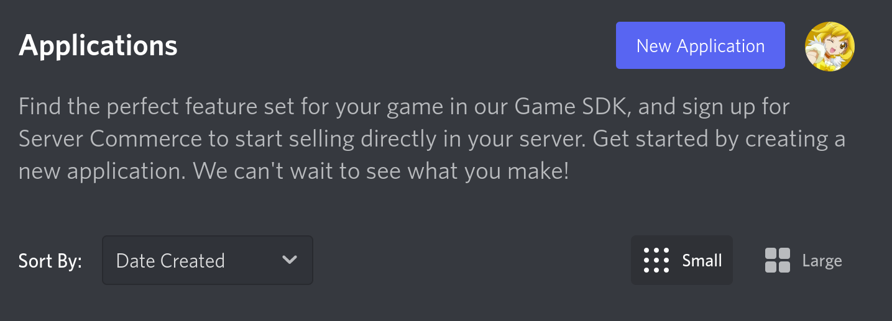
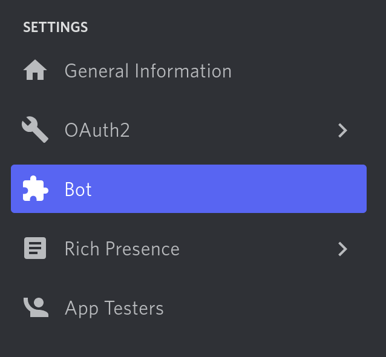
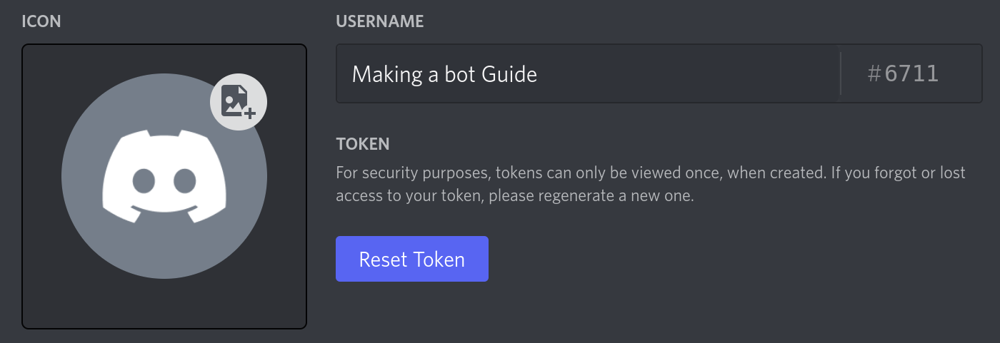

# Installation

`hikari-crescent` supports Python 3.8 and newer.

```sh
pip install hikari-crescent
```

# Creating a Bot Application

Before you can start programming, you need to create a discord bot application.

<div class="grid cards" markdown>

  -  **Create a Bot Application**

    ---

      - Navigate to [The Discord Application Portal](https://discord.com/developers/applications), then click on the blue button that says "New Application".

      {width = 800}
      
      - Click on the "Bot" button.
      
      { width=250 }
    
      - Click on the blue "Add Bot" button, and pick a memorable name!

        

      ---
      **Finding your token** (For rest bots)
      ---

      Navigate to the bot page. Press the "Reset Token" button to claim your token. You may need to enter a authentication code. Write this down and don't share it to anybody. It will give them access to your bot!

    
      

  - **Invite the Bot**
    
    ---
    - Navigate to the oauth2 url generator.

      

    - Select the bot scope.

      

    - Scroll farther down to the bottom of the page. Press the copy button.

      


    Paste this URL into your web browser. You will get an invite page for your bot. Add the bot to a server you are going to develop it on.

      


</div>

!!! note

    Setting up a REST bot on the discord developer portal is very complicated, so this guide does not cover that. Please read the Discord documentation if you want to use a REST bot.

## Basics

Copy this code into a python file, and run with `python filename.py`.

=== "Gateway"

    ```python
    import crescent
    import hikari

    bot = hikari.GatewayBot("YOUR_TOKEN")
    client = crescent.Client(bot)

    @client.include
    @crescent.command(name="say")
    class Say:
        word = crescent.option(str, "The word to say")

        async def callback(self, ctx: crescent.Context) -> None:
            await ctx.respond(self.word)

    bot.run()
    ```

=== "REST"

    ```python
    import crescent
    import hikari

    bot = hikari.RESTBot("YOUR_TOKEN")
    client = crescent.Client(bot)

    @client.include
    @crescent.command(name="say")
    class Say:
        word = crescent.option(str, "The word to say")

        async def callback(self, ctx: crescent.Context) -> None:
            await ctx.respond(self.word)

    bot.run()
    ```

## Tooling
It is recommended to use a typechecker when working with crescent. Both the [Mypy](https://github.com/python/mypy) and [Pyright](https://github.com/microsoft/pyright) typecheckers are supported. The developer recommends pyright if you don't know what to pick.

!!! warning

    Crescent does not throw exceptions for issues a typechecker would catch. Use a typechecker.

## Next Steps

🎉 Congratulations! At this point you should have a bot. Now you should check out the [guides](../guides), or if want to jump straight into coding, check out the [template project](https://github.com/hikari-crescent/template) for some quick examples.
