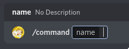

# Commands


Before you can create a command, you need to create a bot.

=== "Gateway"
    ```python
    import crescent
    import hikari

    bot = hikari.GatewayBot("YOUR_TOKEN")
    client = crescent.Client(bot)

    # `bot.run()` starts the bot.
    # Any code after this line will not be run until the bot is closed. 
    bot.run()
    ```
=== "REST"
    ```python
    import crescent
    import hikari

    bot = hikari.RESTBot("YOUR_TOKEN")
    client = crescent.Client(bot)

    # `bot.run()` starts the bot.
    # Any code after this line will not be run until the bot is closed. 
    bot.run()
    ```


!!! warning

    Storing your token in your source code is a bad idea. Store your TOKEN in a `.env` file.


The first command we will make is the ping command.


=== "Gateway"
    ```python
    bot = hikari.GatewayBot("YOUR_TOKEN")
    client = crescent.Client(bot)

    # Commands can be defined after you create the client variable
    # and before `bot.run()`

    @client.include
    @crescent.command(name="ping", description="Ping the bot.")
    class PingCommand:
        async def callback(self, ctx: crescent.Context) -> None:
            await ctx.respond("Pong!")

    bot.run()
    ```

=== "REST"
    ```python
    bot = hikari.RESTBot("YOUR_TOKEN")
    client = crescent.Client(bot)

    # Commands can be defined after you create the client variable
    # and before `bot.run()`

    @client.include
    @crescent.command(name="ping", description="Ping the bot.")
    class PingCommand:
        async def callback(self, ctx: crescent.Context) -> None:
            await ctx.respond("Pong!")

    bot.run()
    ```

> ⚠️ Commands must call `await ctx.respond()` within 3 seconds or call `await ctx.defer()` to
> get 15 minutes to respond.


So what's going on here? `@crescent.command` turns your class into a command object.
`@bot.include` adds the command to your bot. Many objects in Crescent can be added
to your bot with `@bot.include`, these are called Includables and we will go over
them in more detail later.

If you are new to Python, you may not have seen `ctx: crescent.Context` before. This
is called a type hint. It tells the reader what type `ctx` is, and your IDE can use
type hints to provide better autocomplete. Although they are not required, it is
recommended to use type hints whenever you can.

```python
#      The name of the argument   The return type
#                 \/                    \/
def my_function(argument: SomeType) -> None:
#                           /\
#                The type of the argument
#
# The argument name and argument type
# are separated with a colon.
```

### Adding Options

Options are added by adding class-attrs to the class.

```python
@client.include
@crescent.command(name="say")
class SayCommand:
# The name of the command option
#    \/
    word = crescent.option(str)
#                           /\
# The type of the command option

    async def callback(self, ctx: crescent.Context) -> None:
        # options are accessed attributes on the class
        await ctx.respond(self.word)
```

Crescent's option syntax is type safe. This means that commands will
seamlessly work with typecheckers like mypy and pyright.
(You don't need to worry about this if you are new to Python!)

Class commands can be cumbersome for small commands. Crescent provides function
commands for those cases.

```python
@client.include
@crescent.command
async def ping(ctx: crescent.Context):
    await ctx.respond("Pong!")
```

It is recommended to use function commands when your command does not have any options.

## User and Message commands

So far only slash commands have been covered. There is two more types of application
commands: user context menu and message context menu commands. You can use these
by right clicking on a user or message respectively.

Both user and message commands are only supported as functions.

```python
@bot.include
@crescent.user_command
async def user_command(ctx: crescent.Context, user: hikari.User):
    ...


@bot.include
@crescent.message_command
async def message_command(ctx: crescent.Context, message: hikari.Message):
    ...
```


## Command Options
This is what a command with an option called `name` looks like in the Discord client..



Options can also have a custom description and name. If no description is provided,
the description will default to "No Description". This example shows an option 
amed "option" with the description "your custom description". The secondoption, `option2`,
has the name "custom-name" and description "also your custom description".

```python
@client.include
@crescent.command
class MyCommand:
    option = crescent.option(str, "your custom description")
    option2 = crescent.option(str, name="custom-name", description="also your custom description")

    async def callback(self, ctx: crescent.Context) -> None:
        ...

    # The `...` is a placeholder that means that your code
    # should go there instead.
```

## Option Types
Crescent provides these option types. You can find more information on option types [here](https://discord.com/developers/docs/interactions/application-commands#application-command-object-application-command-option-type) (You can ignore `SUBCOMMAND` and `SUBCOMMAND_GROUP` for now.)
This might look a bit daunting, but we will go into detail on what each option type is in this section.

| Type | Option Type |
|---|---|
| [`str`][str] | Text |
| [`int`][int] | Integer |
| [`bool`][bool] | Boolean |
| [`float`][float] | Number |
| [`hikari.User`][hikari.users.User] | User |
| [`hikari.Role`][hikari.guilds.Role] | Role |
| [`crescent.Mentionable`][crescent.mentionable.Mentionable] | Role or User |
| [`hikari.PartialChannel`][hikari.channels.PartialChannel] | Channel. The options will be the channel type and its subclasses. |
| [`list`][list][[`hikari.PartialChannel`][hikari.channels.PartialChannel]] | Channel. ^ |
| [`hikari.Attachment`][hikari.messages.Attachment] | Attachment |

### Making Parameters Optional
Options will be optional if a default value is provided. This example
shows an option with the default value `None`.

```python
@client.include
@crescent.command(name="command")
class MyCommand:
    optional_option = crescent.option(str, default=None)

    async def callback(self, ctx: crescent.Context) -> None:
        ...
```


### More Information on Types

Strings, Ints, Floats, and Booleans all use python's built in types.

!!! note

    If you are comfortable reading function overloads you can look at [the source code](https://github.com/hikari-crescent/hikari-crescent/blob/main/crescent/commands/options.py#L174).

```python
@client.include
@crescent.command(name="command")
class MyCommand:
    word = crescent.option(str)
    integer = crescent.option(int)
    number = crescent.option(float)
    boolean = crescent.option(bool)

    async def callback(self, ctx: crescent.Context) -> None:
        # You can now do something with the options.
        await ctx.respond(
            f"{self.word}\n{self.integer}\n{self.number}\n{self.boolean}"
        )
```

These types use a hikari object.
```python
import hikari

@client.include
@crescent.command(name="command")
class MyCommand:
    user = crescent.option(hikari.User)
    role = crescent.option(hikari.Role)
    attachment = crescent.option(hikari.Attachment)

    # The channel type will be restricted depending on what
    # channel object you choose. In this example only channels
    # that users can type in can be chosen.
    channel = crescent.option(hikari.TextableChannel)

    # This option can only be voice channels.
    voice_channel = crescent.option(hikari.GuildVoiceChannel)


    async def callback(self, ctx: crescent.Context) -> None:
        ...
```

The final option type is mentionable, which allows a user to choose a user or role.

```python
import hikari

@client.include
@crescent.command(name="command")
class MyCommand:
    mentionable = crescent.option(crescent.Mentionable)

    async def callback(self, ctx: crescent.Context) -> None:
        if self.mentionable.user:
            # This is a user. `mentionable.role` will be `None`.
            await ctx.respond("You picked a user!")
        if self.mentionable.role:
            # This is a role. `mentionable.user` will be `None`.
            await ctx.respond("You picked a role!")
```

### Autocomplete

Autocomplete is a way for your command to suggest values for an option.
The `autocomplete=` kwarg can be used for `int`, `float`, and `str` types.

```python
async def autocomplete_response(
    ctx: crescent.AutocompleteContext, option: hikari.AutocompleteInteractionOption
) -> Sequence[tuple[str | int | float, str]]:
    return [("Some Option", "1234")]

@client.include
@crescent.command
class class_example:
    result = crescent.option(str, "Respond to the message", autocomplete=autocomplete_response)

    async def callback(self, ctx: crescent.Context) -> None:
        await ctx.respond(self.result, ephemeral=True)
```

Options can also be accessed inside the callback. The `ctx.options` dictionary contains snowflakes or
values for all the options a user has already filled out. The `ctx.fetch_values` function converts the
snowflakes in this dictionary to the correct type and returns it. If you bot object is `hikari.impl.CacheAware`
these values are fetched from the cache. Otherwise, they need to be fetched from a REST endpoint.

```python
async def fetch_autocomplete_options(
    ctx: crescent.AutocompleteContext, option: hikari.AutocompleteInteractionOption
) -> Sequence[tuple[str, str]]:
    # An option dict where discord objects are all snowflakes.
    options = ctx.options

    # Return options with snowflakes converted into the option types.
    options = await ctx.fetch_options()

    # Return no options.
    return []

bot.run()
```

## Command Groups

Commands can be grouped or grouped into groups of groups.
In Crescent these groups are called `groups` and `sub_groups`.


```python
import crescent

# Create a group
group = crescent.Group("outer-group")
# Create a sub group
sub_group = group.sub_group("inner-group")
```

To add a command to a group simply do:

```python
@client.include
@group.child
@crescent.command
async def group_command(ctx: crescent.Context):
    ...

@client.include
@sub_group.child
@crescent.command
async def sub_group_command(ctx: crescent.Context):
    ...
```

Do not combine the `group` and `sub_group` decorators. This will cause a command to be
registered multiple times.

You can not create a group with the same name as a command.
```python
help_group = crescent.Group("help")

@client.include
@help_group.child
@crescent.command
async def say(ctx: crescent.Context):
    ...

# This command will cause the bot to crash
@client.include
@crescent.command
async def help(ctx: crescent.Context):
    ...
```
